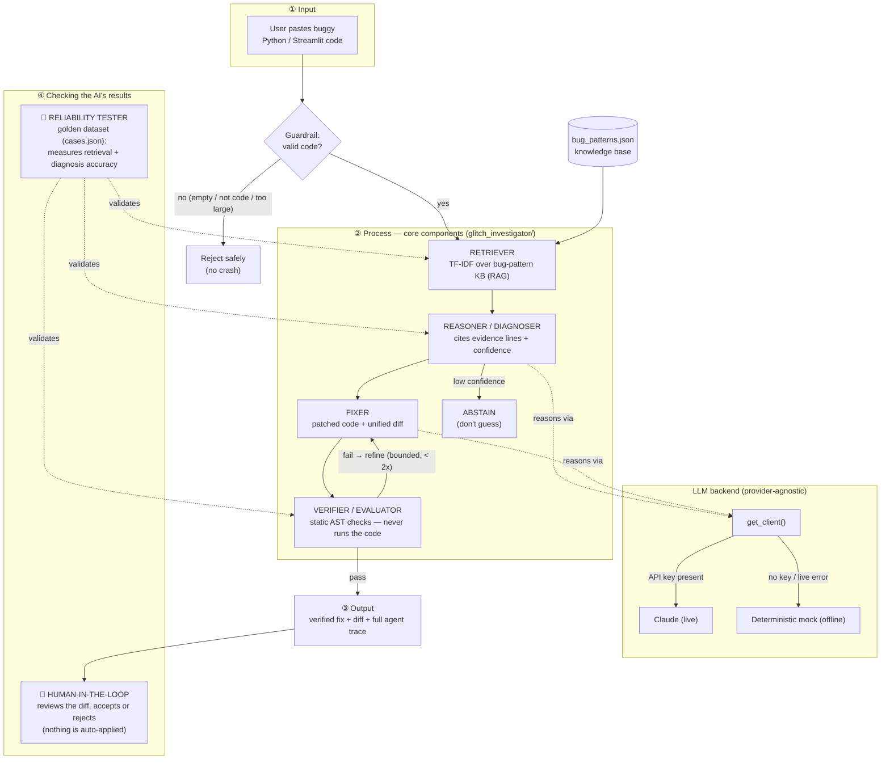

# 🎮 Game Glitch Investigator: The Impossible Guesser

## 🚨 The Situation

You asked an AI to build a simple "Number Guessing Game" using Streamlit.
It wrote the code, ran away, and now the game is unplayable. 

- You can't win.
- The hints lie to you.
- The secret number seems to have commitment issues.

---

## 🤖 Final Project: the AI Glitch Investigator

The original mission (below) was to hand-debug the game. The **final project**
extends it into a full applied AI system: **the AI that investigates glitches
for you.** Paste buggy Python/Streamlit code and it:

1. **Retrieves** similar known bug patterns (RAG / Module 4)
2. **Reasons** about the fault with cited evidence and a confidence score (Module 3)
3. **Proposes a fix** as a reviewable diff, and **verifies** its own answer in a
   bounded agentic loop — without ever executing your code (Module 5)
4. **Reliability-tests** itself against a labeled golden dataset (Module 5)

Open the **🕵️ Glitch Investigator** page in the app and load the *"Original
glitchy game"* preset to watch the AI rediscover the very bugs this project
started with.

- **Provider-agnostic:** uses Claude when `ANTHROPIC_API_KEY` is set, and a
  deterministic offline mock otherwise — so it runs and all tests pass **with no
  API key**. To enable live Claude reasoning: `export ANTHROPIC_API_KEY=...`
- **Trustworthy by design:** grounded citations, abstains when unsure, never
  executes untrusted code, treats input as data (injection-resistant), and keeps
  a human in the loop. Full write-up in **[DESIGN.md](DESIGN.md)**.
- **Logged & fault-tolerant:** every run logs each step (`glitch_investigator`
  logger); a live API failure logs the error and falls back to the offline mock
  instead of crashing.
- **Code:** [glitch_investigator/](glitch_investigator/) · **Tests:**
  `pytest tests/test_retriever.py tests/test_agent.py tests/test_reliability.py`

### 🧭 System diagram

Source: [diagrams/architecture.mmd](diagrams/architecture.mmd) (Mermaid). Shows the
main components, the data flow (input → process → output), and where a **human**
and the **reliability tests** check the AI's results.



---

## 🛠️ Setup

1. Install dependencies: `pip install -r requirements.txt`
2. Run the app: `python -m streamlit run app.py`
   (the game is the home page; the 🕵️ Glitch Investigator is in the sidebar)

## 🕵️‍♂️ Your Mission

1. **Play the game.** Open the "Developer Debug Info" tab in the app to see the secret number. Try to win.
2. **Find the State Bug.** Why does the secret number change every time you click "Submit"? Ask ChatGPT: *"How do I keep a variable from resetting in Streamlit when I click a button?"*
3. **Fix the Logic.** The hints ("Higher/Lower") are wrong. Fix them.
4. **Refactor & Test.** - Move the logic into `logic_utils.py`.
   - Run `pytest` in your terminal.
   - Keep fixing until all tests pass!

## 📝 Document Your Experience

- [x] **Describe the game's purpose.** A Streamlit number-guessing game: the app
  picks a secret number in a range that depends on difficulty (Easy 1–20,
  Normal 1–100, Hard 1–200). You enter guesses and the game tells you whether
  to go higher or lower until you find it or run out of attempts. Score rewards
  winning in fewer attempts.

- [x] **Detail which bugs you found.**
  1. **Backwards hints** — guessing too high told you to "Go HIGHER" and vice
     versa (the hint message was mapped to the wrong outcome).
  2. **Secret compared as a string** — on every even attempt the secret was cast
     to `str`, so `check_guess` compared `int` vs `str`, hit a silent `TypeError`
     fallback, and returned garbage hints.
  3. **New Game didn't fully reset** — it left `status`, `score`, and `history`
     stale and ignored the difficulty range, so Submit stayed dead after a
     win/loss.
  4. **Erratic scoring** — wrong guesses randomly added/subtracted 5 points.
  5. **Misc** — attempts started at 1 (off-by-one "attempts left"), and the prompt
     hardcoded "between 1 and 100" regardless of difficulty.

- [x] **Explain what fixes you applied.**
  - Moved `get_range_for_difficulty`, `parse_guess`, `check_guess`, and
    `update_score` into `logic_utils.py` (pure, testable functions).
  - Fixed `check_guess` to coerce both values to `int` and return the correct
    outcome; moved hint text into a `HINTS` map in `app.py` with the right
    directions.
  - Removed the even-attempt `str(secret)` cast.
  - Made `New Game` call a single `start_new_game()` that resets all state and
    uses the difficulty range.
  - Rewrote `update_score` so wrong guesses never change the score and a win
    rewards fewer attempts (min 10 points).
  - Started attempts at 0 and made the range text dynamic.

## 📸 Demo Walkthrough

A sample game (Normal difficulty, secret = 50) from start to finish:

1. App loads, picks a secret in 1–100, and shows "Attempts left: 8".
2. User enters a guess of `40` → game returns "📈 Too low — go HIGHER!".
3. User enters a guess of `70` → game returns "📉 Too high — go LOWER!".
4. User enters `50` → "🎉 Correct!", balloons appear, and the score updates
   (fewer attempts = more points; this 3rd-attempt win scores 80).
5. The game ends, shows the secret and final score, and prompts for a New Game.
6. Clicking **New Game 🔁** clears the score/history/status and picks a fresh
   secret — Submit works immediately for the next round.

**Screenshot** *(optional)*: <!-- Insert a screenshot of your fixed, winning game here -->

## 🧪 Test Results

```
============================= test session starts ==============================
platform darwin -- Python 3.13.13, pytest-9.0.3, pluggy-1.6.0
collected 40 items

tests/test_agent.py ..........                                           [ 25%]
tests/test_game_logic.py ........                                        [ 45%]
tests/test_reliability.py ................                               [ 85%]
tests/test_retriever.py ......                                           [100%]

============================== 40 passed in 0.08s ==============================
```

The 8 original game-logic tests still pass, plus 32 new tests covering the AI
Investigator: the RAG retriever, the agentic pipeline (including its live-error
fallback), and the golden-dataset reliability + robustness suite — all offline,
no API key required.

## 🚀 Stretch Features

- [ ] [If you choose to complete Challenge 4, describe the Enhanced UI changes here — a screenshot is optional]
